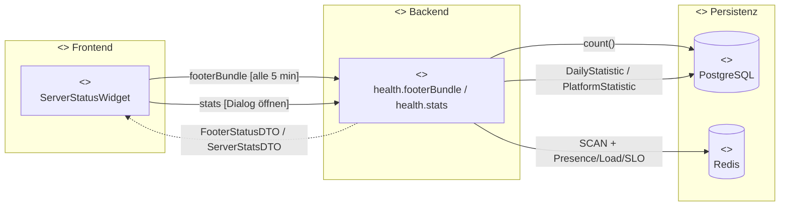
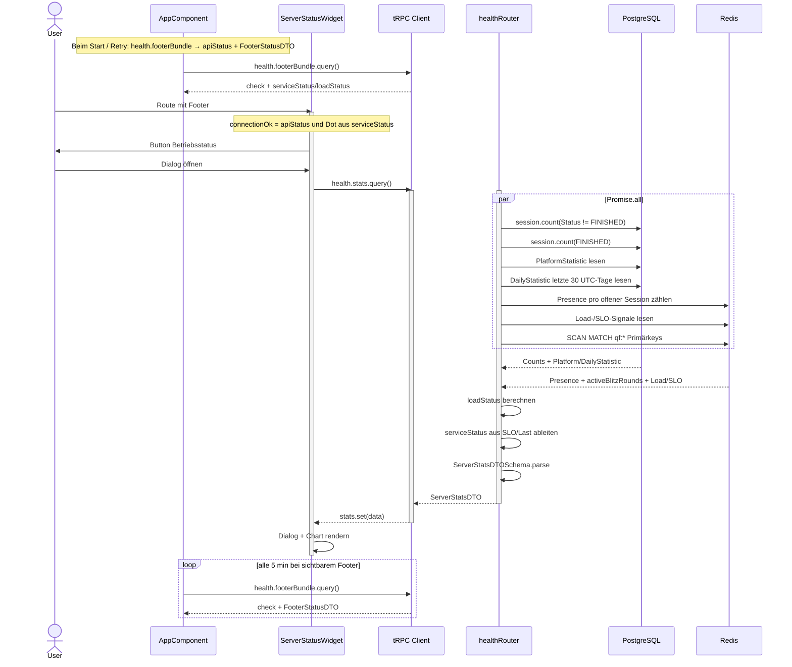
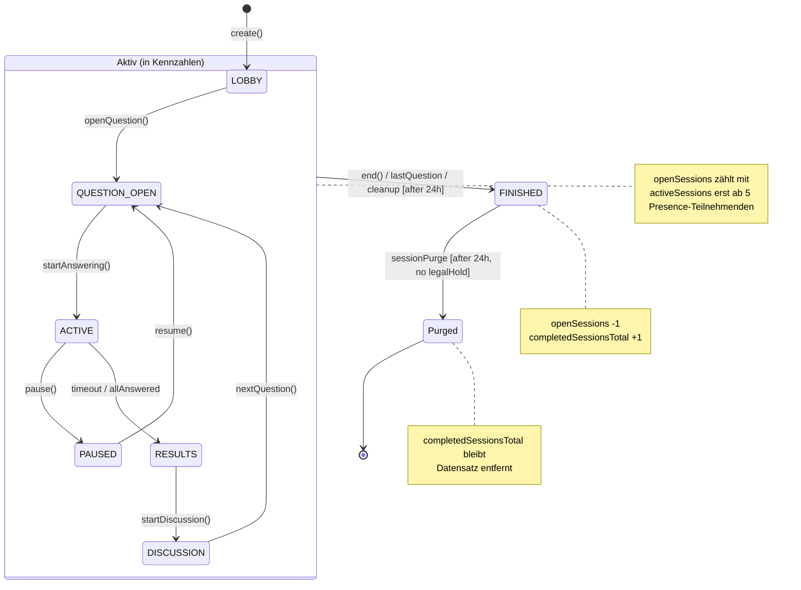
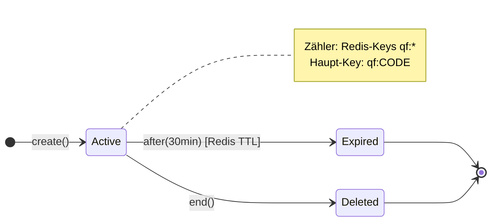
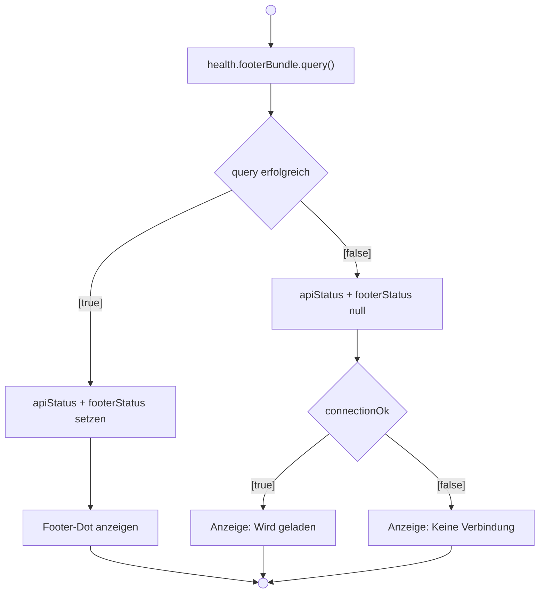
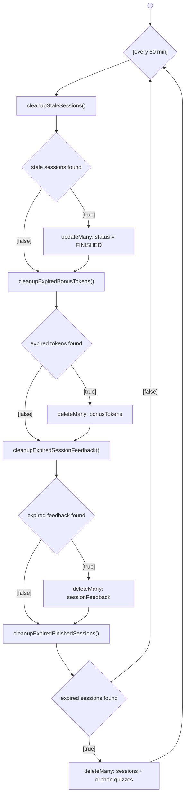

# Server-Status-Widget (Story 0.4)

> **Zielgruppe:** Product Owner, Entwickler  
> **Stand:** 2026-05-30 (Abgleich mit `health.ts` `stats`/`footerBundle` inkl. `PlatformStatistic`, `DailyStatistic`, SLO-/Lastsignalen, `server-status-widget.component.ts`, `server-status-help-dialog.component.ts`, `app.component.html` / `app.component.ts`)

## Was zeigt das Widget?

Das Server-Status-Widget steht im **globalen App-Footer** (`app.component.html`) und öffnet den
Betriebsstatus-Dialog. Im kompakten Footer selbst werden nur Label und farbiger Status-Dot
angezeigt; die Kennzahlen stehen im **Hilfe-Dialog**. Der Footer (inkl. Widget) wird **nicht**
angezeigt auf der **Standalone-Blitzlicht-Route** (`/feedback/...`) und in der **immersiven
Host-Ansicht** (`isImmersiveHostView`).

| Kennzahl                 | Icon            | Bedeutung                                                                                                 |
| ------------------------ | --------------- | --------------------------------------------------------------------------------------------------------- |
| Offene Sessions          | ▶ play_circle   | Noch nicht beendete Sessions (Status ≠ `FINISHED`)                                                        |
| Aktive Sessions          | ▶ play_circle   | Offene Sessions mit mindestens 5 aktiven Teilnehmenden in der Redis-Presence der letzten Minuten          |
| Blitz-Runden             | ⚡ bolt         | Laufende Blitzlicht-/Quick-Feedback-Runden (Redis-Primärkeys `qf:<code>`, siehe Backend)                  |
| Teilnehmende             | 👥 group        | Aktive Teilnahmen über laufende Sessions aus Redis-Presence                                               |
| Abgeschlossene Quizzes   | ✅ check_circle | Monotoner Gesamtzähler aus `PlatformStatistic.completedSessionsTotal` bzw. Fallback auf `FINISHED`-Zeilen |
| Stimmen/Statuswechsel    | timeline        | Diagnosewerte der letzten Minute (`votesLastMinute`, `sessionTransitionsLastMinute`)                      |
| Countdown-Sessions       | timer           | Sessions mit aktivem Countdown im aktuellen Zeitfenster                                                   |
| Allzeit- und Tagesrekord | emoji_events    | `PlatformStatistic.maxParticipantsSingleSession` und 30 UTC-Tage aus `DailyStatistic`                     |

Der Footer ruft alle 5 Minuten **`health.footerBundle`** ab. Dieser Endpoint kombiniert `health.check`
mit einem schlanken `FooterStatusDTO` (`serviceStatus`, `loadStatus`). Beim Öffnen des Dialogs lädt
die App **`health.stats`** frisch nach; der Dialog rendert die vollständigen Kennzahlen und den
30-Tage-Verlauf.

### Status-Dot (Ampel)

| Farbe   | Bedeutung                 | Datenbasis                                                                  |
| ------- | ------------------------- | --------------------------------------------------------------------------- |
| 🟢 Grün | Stabil (`serviceStatus`)  | `serviceStatus = stable`                                                    |
| 🟡 Gelb | Eingeschränkt             | `serviceStatus = limited`                                                   |
| 🔴 Rot  | Kritisch                  | `serviceStatus = critical`                                                  |
| ⚪ Grau | Unbekannt / nicht geladen | `connectionOk=false`, initiales Laden oder kein `FooterStatusDTO` vorhanden |

**Hinweis:** Der Dot ist heute ein **Betriebsstatus** (`serviceStatus`) und nicht mehr nur eine
Schwellwert-Ampel auf `activeSessions`. `loadStatus` bleibt als Diagnosewert im Detaildialog sichtbar.

---

## Datenfluss (Komponentendiagramm)



### Ablauf (Sequenzdiagramm)



---

## Datenquellen im Detail

### PostgreSQL (via Prisma)

| Kennzahl                     | Query                                                                 | Filter                                                                                             |
| ---------------------------- | --------------------------------------------------------------------- | -------------------------------------------------------------------------------------------------- |
| Kennzahl / Daten             | Query / Quelle                                                        | Filter / Semantik                                                                                  |
| ---------------------------- | --------------------------------------                                | -------------------------------------------------------------------------------------------------- |
| Offene Sessions              | `prisma.session.count(…)`                                             | Status ≠ `FINISHED`                                                                                |
| Abgeschlossene Quizzes       | `PlatformStatistic.completedSessionsTotal` / Fallback `session.count` | monotoner Gesamtzähler, damit Purge den Wert nicht senkt                                           |
| Allzeit-Rekord               | `PlatformStatistic`                                                   | `maxParticipantsSingleSession`, `updatedAt`                                                        |
| Tagesrekord-Verlauf          | `prisma.dailyStatistic.findMany(…)`                                   | letzte 30 UTC-Tage, Lücken werden mit `count=0` aufgefüllt                                         |
| Quiz-/Session-Inhalte        | Session/Quiz-Tabellen                                                 | nur indirekt für Counts; keine Inhalte im Footer-Status                                            |

### Redis

| Kennzahl                 | Methode                 | Details                                                                                                   |
| ------------------------ | ----------------------- | --------------------------------------------------------------------------------------------------------- |
| Kennzahl / Signal        | Methode                 | Details                                                                                                   |
| ------------------------ | ----------------------- | --------------------------------------------------------------------------------------------------------  |
| Aktive Teilnehmende      | Presence-Keys           | nur offene Sessions; Presence-Fenster siehe Backend `presence`                                            |
| Aktive Sessions          | Presence pro Session    | nur offene Sessions mit mindestens `ACTIVE_SESSION_MIN_PARTICIPANTS = 5`                                  |
| Blitz-Runden             | `SCAN` mit `MATCH qf:*` | es zählen nur Primärkeys `qf:<code>`, keine `qf:voters:*`, `qf:choices:*`, `qf:choices:r1:*`, `qf:host:*` |
| Votes / Statuswechsel    | Load-Signale            | Werte der letzten Minute                                                                                  |
| SLO-Signale              | SLO-Telemetrie          | Request-Sample, Fehlerrate, p95/p99-Latenz                                                                |

---

## Lebenszyklus der Daten (Wann sinken/verschwinden Kennzahlen?)

### Offene Sessions, aktive Sessions & Teilnehmende

Eine Session fällt aus der „offen"-Zählung, sobald ihr Status auf `FINISHED` wechselt.
Als **aktiv** zählt sie erst, wenn mindestens 5 Teilnehmende innerhalb des Presence-Fensters sichtbar sind.
Das geschieht durch:

| Auslöser               | Beschreibung                                 | Timing                  |
| ---------------------- | -------------------------------------------- | ----------------------- |
| **Manuell**            | Dozent beendet die Session (`session.end`)   | Sofort                  |
| **Automatisch**        | Letzte Frage wurde beantwortet → `FINISHED`  | Sofort                  |
| **Cleanup (verwaist)** | Session seit > **24 h** aktiv ohne Aktivität | Stündlicher Cleanup-Job |

Teilnehmende werden nicht einzeln aus PostgreSQL entfernt. Für den Live-Status zählt Redis-Presence;
sobald Presence abläuft oder die Session beendet ist, sinken die Live-Zahlen.

### Abgeschlossene Quizzes

| Auslöser          | Beschreibung                                                                                                                                                                | Timing                  |
| ----------------- | --------------------------------------------------------------------------------------------------------------------------------------------------------------------------- | ----------------------- |
| **Session Purge** | `FINISHED`-Sessions werden frühestens **24 h nach Beendigung** gelöscht, aber nur wenn kein aktiver Legal Hold und keine frischen Bonus-Tokens/Session-Feedbacks existieren | Stündlicher Cleanup-Job |
| **Legal Hold**    | Sessions mit `legalHoldUntil` in der Zukunft bleiben erhalten                                                                                                               | Bis Ablauf des Holds    |

Beim Purge werden auch verwaiste Quizzes gelöscht (Quizzes ohne verbleibende Sessions).
Der angezeigte Gesamtwert `completedSessions` sinkt dadurch nicht, weil `completedSessionsTotal`
monoton in `PlatformStatistic` geführt wird.

### Blitz-Runden (Redis)

| Auslöser    | Beschreibung                                                       | Timing                  |
| ----------- | ------------------------------------------------------------------ | ----------------------- |
| **TTL**     | Alle `qf:*`-Keys haben ein `EXPIRE` von **30 Minuten**             | Automatisch durch Redis |
| **Manuell** | Host beendet die Runde (`quickFeedback.end` löscht die Redis-Keys) | Sofort                  |

### Lebenszyklus einer Session (Zustandsdiagramm)



### Lebenszyklus einer Blitz-Runde (Zustandsdiagramm)



---

## Fehlerverhalten (Aktivitaetsdiagramm)



| Situation                                  | Backend                                                           | Frontend                                                                        |
| ------------------------------------------ | ----------------------------------------------------------------- | ------------------------------------------------------------------------------- |
| DB oder Redis nicht erreichbar             | Fallback: Werte `0`, `serviceStatus=stable`, `loadStatus=healthy` | Dialog zeigt Fallbackwerte, Footer-Dot bleibt stabil wenn `health.check` ok ist |
| tRPC `health.footerBundle` schlägt fehl    | –                                                                 | `apiStatus=null`, `footerStatus=null` → grauer Dot und Retry-Aktion             |
| tRPC `health.stats` im Dialog schlägt fehl | –                                                                 | `footerStats=null` → Dialog zeigt Lade-/Fehlerzustand statt Kennzahlen          |

---

## Darstellung

Das Widget ist heute ein kompakter Footer-Button. Die frühere `compact`-Variante wurde entfernt;
alle Kennzahlen liegen im Dialog.

| Element       | Verwendung                  | Darstellung                                   |
| ------------- | --------------------------- | --------------------------------------------- |
| Footer-Button | globale App-Footer-Zeile    | Status-Dot + Label „Betriebsstatus“           |
| Detaildialog  | Klick auf den Footer-Button | Kennzahlen, SLO-/Laststatus und 30-Tage-Chart |

```html
<app-server-status-widget
  class="app-footer__status-widget"
  [connectionOk]="footerConnectionOk()"
  [loading]="!footerHealthCheckDone()"
  [stats]="footerStatus()"
  (openRequested)="openServerStatusHelp()"
/>
```

Der **Hilfe-Dialog** (`ServerStatusHelpDialogComponent`) wird lazy geladen und ruft dann `health.stats` ab.

---

## Cleanup-Scheduler (Hintergrund-Jobs)

Der Scheduler startet mit dem Backend und läuft **jede Stunde** (`sessionCleanup.ts`):

_Aktivitätsdiagramm_



| Job                       | Aktion                                                                 | Schwellwert                             |
| ------------------------- | ---------------------------------------------------------------------- | --------------------------------------- |
| 1. Stale Sessions         | Aktive Sessions ohne Aktivität seit > 24 h → `FINISHED`                | `STALE_SESSION_HOURS = 24`              |
| 2. Bonus-Token Purge      | Bonus-Tokens älter als 90 Tage → gelöscht                              | `BONUS_TOKEN_RETENTION_DAYS = 90`       |
| 3. Session-Feedback Purge | Feedback zu beendeten Sessions älter als 90 Tage → gelöscht            | `SESSION_FEEDBACK_RETENTION_DAYS = 90`  |
| 4. Session Purge          | Beendete Sessions > 24 h nach Ende → gelöscht, wenn Retention frei ist | `FINISHED_SESSION_RETENTION_HOURS = 24` |

---

## Relevante Dateien

| Bereich                         | Datei                                                                           |
| ------------------------------- | ------------------------------------------------------------------------------- |
| **Zod-Schema**                  | `libs/shared-types/src/schemas.ts` (`ServerStatsDTOSchema`)                     |
| **Backend Router**              | `apps/backend/src/routers/health.ts` (`stats`, `footerBundle`, `check`, `ping`) |
| **Cleanup**                     | `apps/backend/src/lib/sessionCleanup.ts`                                        |
| **Presence/Load/SLO**           | `apps/backend/src/lib/presence.ts`, `loadSignal.ts`, `sloTelemetry.ts`          |
| **Blitzlicht TTL**              | `apps/backend/src/routers/quickFeedback.ts` (`FEEDBACK_TTL_SECONDS`)            |
| **Frontend Widget**             | `apps/frontend/src/app/shared/server-status-widget/`                            |
| **Hilfe-Dialog**                | `apps/frontend/src/app/shared/server-status-help-dialog/`                       |
| **API-Erreichbarkeit + Footer** | `apps/frontend/src/app/app.component.ts`, `app.component.html`                  |
